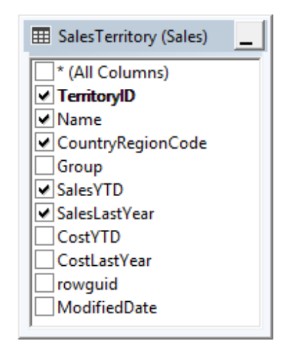
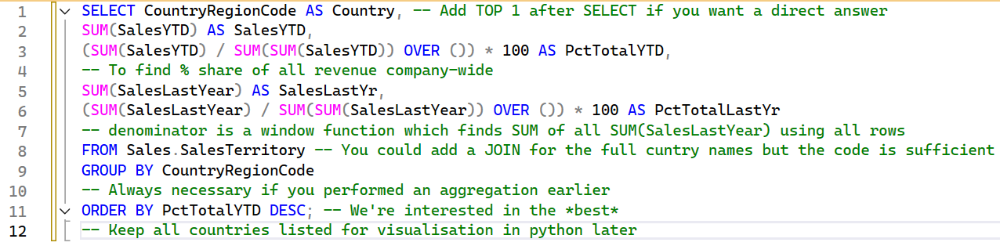
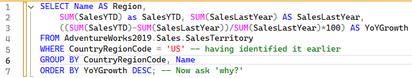

# Overview: What is the regional sales in the best performing country? 

This EDA tutorial guides you through comparing country-level performance, regional trends within the United States, and create visualisations to communicate insights effectively. 

## Schema Map 

Using SQL Server Management Studio. 



_Note: The table was short with only 10 rows (Hit ‘edit top 200 rows’) and cleaning was not required (hit ‘Edit Top 200 rows’ for a quick preview)._ 

# Method 

## PART 1: Finding the ‘best performing country’ 

Starting with SQL Server. ‘Best performance’ was operationalised as the highest total sales in the current year. Therefore, the Sales.SalesTerritory table was used, however, SalesYTD was incomplete for the year so total sales last year and was also calculated to provide a complete picture of performance compared annually. To find the best performing country, the percentage share of total company revenue was calculated for each country. 

The SQL Server script and extra notes: 



For your practice: 

```
SELECT CountryRegionCode AS Country,  
SUM(SalesYTD) AS SalesYTD,  
(SUM(SalesYTD) / SUM(SUM(SalesYTD)) OVER ()) * 100 AS PctTotalYTD, 
SUM(SalesLastYear) AS SalesLastYr, 
(SUM(SalesLastYear) / SUM(SUM(SalesLastYear)) OVER ()) * 100 AS PctTotalLastYr 
FROM Sales.SalesTerritory 
GROUP BY CountryRegionCode 
ORDER BY PctTotalYTD DESC;
```


.csv generated:  
| Country  |    SalesYTD    | PctTotalYTD  |  SalesLastYr   | PctTotalLastYr  | AvgEndOfDayRate  |
|:--------:|:--------------:|:------------:|:--------------:|:---------------:|:----------------:|
| US       | 26411059.8792  | 50.06        | 19402504.6492  | 59.30           | 1.5615           |
| CA       | 6771829.1376   | 12.83        | 5693988.86     | 17.40           | 3.9294           |
| AU       | 5977814.9154   | 11.33        | 2278548.9776   | 6.96            | 1.4138           |
| GB       | 5012905.3656   | 9.50         | 1635823.3967   | 5.00            | 1.5606           |
| FR       | 4772398.3078   | 9.04         | 2396539.7601   | 7.32            | 0.6738           |
| DE       | 3805202.3478   | 7.21         | 1307949.7917   | 3.99            | 1.8461           |

## PART 2: Comparing regional performance in the US 

The SQL Server script and extra notes: 

Year-on-Year growth (%) allows us to compare regional sales over time.  

For your practice: 
```
SELECT Name AS Region, 
SUM(SalesYTD) as SalesYTD, SUM(SalesLastYear) AS SalesLastYear,  
((SUM(SalesYTD)-SUM(SalesLastYear))/SUM(SalesLastYear)*100) AS YoYGrowth 
FROM AdventureWorks2019.Sales.SalesTerritory  
WHERE CountryRegionCode = 'US'  
GROUP BY CountryRegionCode, Name  
ORDER BY YoYGrowth DESC;
```

.csv generated:  

| Region     | SalesYTD       | SalesLastYear  | YoYGrowth     | PctTotalLastYr  | AvgEndOfDayRate  |
|------------|----------------|----------------|---------------|:---------------:|:----------------:|
| Northwest  | 7887186.7882   | 3298694.4938   | 139.10        | 59.30           | 1.5615           |
| Southwest  | 10510853.8739  | 5366575.7098   | 95.85         | 17.40           | 3.9294           |
| Central    | 3072175.118    | 3205014.0767   | -4.14         | 6.96            | 1.4138           |
| Northeast  | 2402176.8476   | 3607148.9371   | -33.40        | 5.00            | 1.5606           |
| Southeast  | 2538667.2515   | 3925071.4318   | -35.32        | 7.32            | 0.6738           |
| DE         | 3805202.3478   | 7.21           | 1307949.7917  | 3.99            | 1.8461           |
## PART 3: Data Visualisation 

Moving to python.  

```
# IMPORT LIBRARIES  
import matplotlib.pyplot as plt # main library for visualisation 
import pandas as pd # for data handling 
import numpy as np  
import os # for setting the file path  
os.chdir(r’C:\Users\Your\Filepath’) 

p1= pd.read_csv('Q1Part1.csv') # from SQL 
p2= pd.read_csv('Q1Part2.csv') 
print(p1.head()) # preview dataframe 
print(p2.head()) 

fig, axes = plt.subplots(1,2, figsize=(14,6)) # to plot side by side

### 
# FIGURE 1: NESTED DOUGHNUTS OF SALES YTD AND LAST YEAR BY COUNTRY 
# 1.1 define things for visualisation: colours 
colors = ['royalblue', 'dimgrey', 'grey', 'darkgrey', 'silver', 'lightgrey'] 
colors2 = ['lightsteelblue','lightgrey', 'gainsboro','whitesmoke','white','snow'] 

# 1.2 building the visualisation 
outside_donut = axes[0].pie(p1['SalesYTD'], labels=p1['Country'], colors=colors, startangle=90, 
                        labeldistance=1.05, autopct='%.2f%%', pctdistance =0.85, # for labels 
                        frame=True) # for full pie 
inside_donut = axes[0].pie(p1['SalesLastYr'], colors=colors2, radius=0.7, startangle=90) 
centre_circle = plt.Circle((0, 0), 0.4, color='white', linewidth=0)  
axes[0].add_artist(centre_circle) # makes the doughnut 

# 1.3 add text 
axes[0].text(0,0,'USA Sales YTD \n $26,411,059', color='royalblue', fontsize=10,  
# making use of the centre space 
        fontweight='bold', horizontalalignment='center', verticalalignment='bottom')  
axes[0].text(0,0,'$19,402,504 \n Last Year', color='steelblue', fontsize=6,  
        fontweight='bold', horizontalalignment='center', verticalalignment='top') 
axes[0].set_title('The United States continues \n to be the Best Performing Country', weight='bold', fontsize=18) 
 
# FIGURE 2: SIDE-BY-SIDE BAR PLOTS OF SALES BY REGION IN USA 
# 2.1 define things for the visualisation: column positions on x-axis 
width, x = 0.2, np.arange(len(p2['Region']))  

bar1=axes[1].bar(x - width, p2['SalesYTD'], width=width, label='YTD',  
            color='royalblue', zorder=2, edgecolor='dimgrey') # named this group for labelling later 
axes[1].bar(x, p2['SalesLastYear'], width=width, label='Last Year',  
            color='lightsteelblue', zorder=2, edgecolor='dimgrey') # note this group is unnamed 

# 2.2 add details to axes 
axes[1].set_xlabel('Region', weight='bold') 
axes[1].set_ylabel('Total Sales', weight='bold') 
axes[1].set_xticks(x, labels= p2['Region'].tolist()) 
axes[1].set_yticks(range(0,11000001,1000000),[f'{round(x/1000000)}M' for x in range(0, 11000001, 1000000)]) 
plt.ylim(0, 11000000) 
axes[1].grid(axis='y', alpha=0.3, zorder=0) 

# 2.3 adding labels to bars (why we named groups earlier) 
pct=p2['YoYGrowth'] 
i = 0 
for p in bar1: 
    width = p.get_width() # for positioning 
    height = p.get_height() 
    x, y = p.get_xy()  
    plt.text(x+width/2, y+height*1.02, str(pct[i])+'%', fontsize=6, weight='bold', ha='center') 
    i+=1 # to loop!

# 2.4 add text 
axes[1].set_title('Total Revenue by US Region', weight='bold', size=18) 
axes[1].legend(loc='upper right') 
axes[1].text(1,6000000, 'northwest and southwest \nregions doubled their revenue', color='royalblue') 

### 
plt.tight_layout()  
plt.show() 
```

# Findings 

The *Central region is seeing steady growth* and will likely outperform last years’ sales before the end of the year.  

The *Northwest and Southeast region sales are underperforming* against expectations. In review of the store dates, it appeared that Northwest, Northeast and Central regions had a *store relocation* as indicated by StartDate and EndDate in table Sales.SalesTerritoryHistory. Perhaps, these sales reflect these changes.  

*Northwest and Southwest regions have doubled their performance this year*. There is unsufficient data surrounding targetted sales promotions in these regions. This may reflect how Northwest and Southwest regions have larger operations (more stores) than other regions in table Sales.SalesTerritoryHistory. 

_Note: Due to the high turnover, we could not investigate the ‘why’ further. Some of our hypotheses are discussed above. It is worth looking at the tables involving discounts and replicating some analyses performed for global comparisons in question 3 here. Please reach out if you attempt this!_ 

 

# Recommendations 

Our recommendation is that Adventure Cycle Works replicates the sales strategies from the successful regions identified. *Inspect these store relocation performances more closely* and strategically invest towards high-growth regions.  

It is also recommended that the company *tracks performance quarterly* instead of annually to maintain growth and intervene quickly where necessary. 

 
