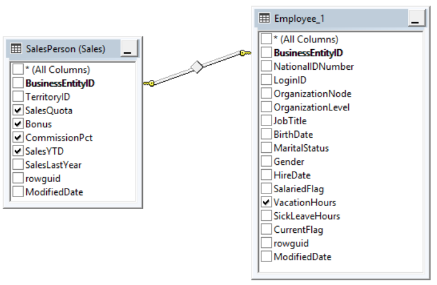
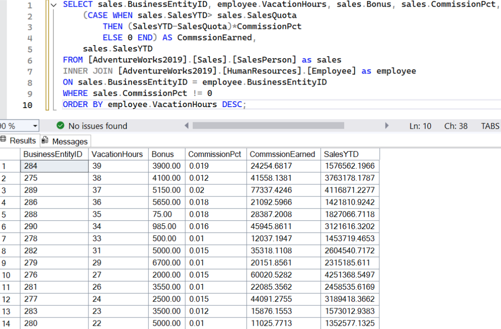
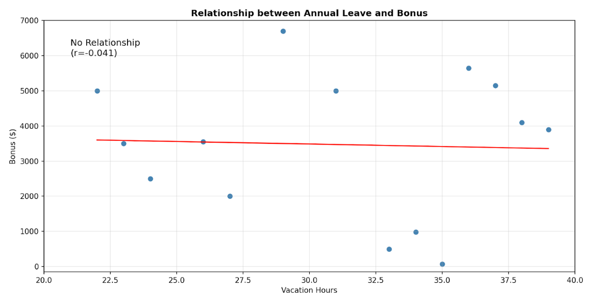
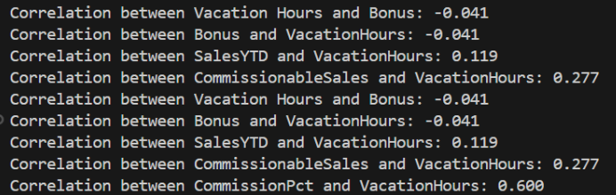
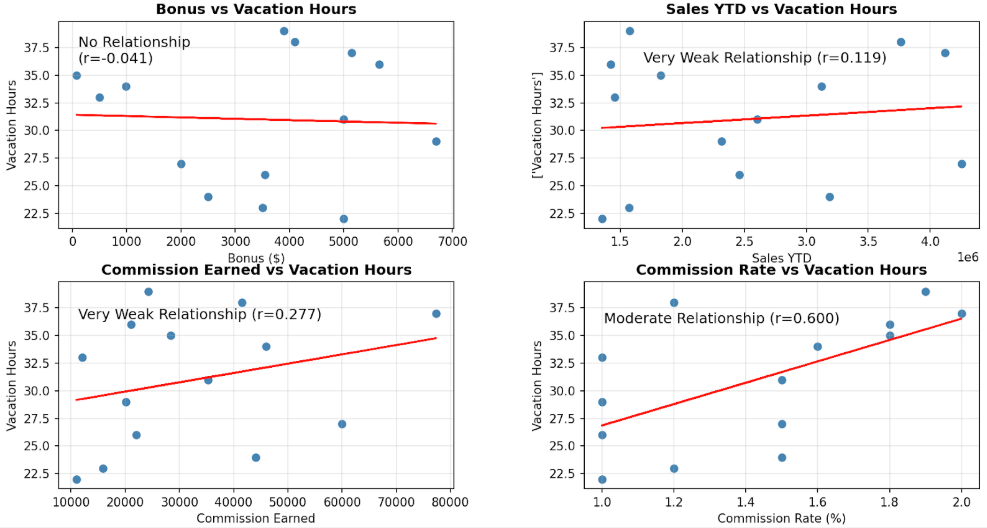

# Overview: What is the relationship between annual leave taken and bonus?

This correlations tutorial guides you through investigatung if there is any link between annual leave taken and bonus

## Schema Map 

Using SQL Server Management Studio. 



# Method 

## PART 1: Finding identifying our variables.

Starting with SQL Server. ‘Annual leave taken’ was operationalised as vacation hours taken and 'bonus' was identified at face-value.  
There were 17 employees in the join of which 14 were Bonus eligible therefore, the sample consisted of 14 sales representatives.  
Other factors of interest were identified: comission percentage, sales year to date and commission earned.  

The SQL Server script and Output: 



Note that Sales Quota was deducted from Sales Year to Date and multiplied by the Commission Rate to find the Commission Earned by each employee.

## PART 2: Correlation Analysis and Visualisation

Moving to python. 

```
# import the toolkits that make everything easier
import pandas as pd
import matplotlib.pyplot as plt
import numpy as np

# load and inspect data
df = pd.read_csv('Q2SQLoutput.csv')
print(df.head()) # inspect first 5 rows
print("Data Summary:")
print(df.info()) # provides dataframe overview

# this is the correlation! it's straightforward but you need to learn what r (the digit printed to 3 decimal places) means
corr = df['VacationHours'].corr(df['Bonus'])
print(f"Correlation between Vacation Hours and Bonus: {corr:.3f}")
```

[Check out this short paper on interpreting correlations](https://pmc.ncbi.nlm.nih.gov/articles/PMC6107969/) but you need to contextualise it yourself and discuss with others in your field.

NOW, VISUALISE!
```
# define our variables for the linear regression (y = a*x + b)
x = df['VacationHours']
y = df['Bonus']
a, b = np.polyfit(x, y, 1)

plt.scatter(x, y, color='steelblue') # this is the scatterplot
plt.plot(x, a*x + b, color='red')  # this is the regression line

# let's make it easier to understand for non-technical stakeholders
plt.title('Relationship between Annual Leave and Bonus', weight='bold')
plt.xlabel('Vacation Hours')
plt.ylabel('Bonus ($)')
plt.ylim(-150, 7000) # this defines the range of our axes
plt.xlim(20, 40)
plt.grid(True, alpha=0.3) # this gives a grid that is somewhat transparent
plt.text(21, 6000, f'No Relationship\n(r={corr:.3f})', fontsize=12) # this is a comment of our conclusion
plt.show()

```


Let's check out related factors that we identified on SQL earlier. 

```
# FOLLOW-UP ANALYSIS
corr1 = df['Bonus'].corr(df['VacationHours'])
print(f"Correlation between Bonus and VacationHours: {corr1:.3f}")
corr2 = df['SalesYTD'].corr(df['VacationHours'])
print(f"Correlation between SalesYTD and VacationHours: {corr2:.3f}")
corr3 = df['CommssionEarned'].corr(df['VacationHours'])
print(f"Correlation between CommissionableSales and VacationHours: {corr3:.3f}")
corr4 = df['CommissionPct'].corr(df['VacationHours'])
print(f"Correlation between CommissionPct and VacationHours: {corr4:.3f}")

```
Here's all our correlations:  



NOW, VISUALISE! These are pretty much the same processes repeated but for different variables and different interpretations added onto the graph
```
# let's make a 2x2 graphs window

fig, axes = plt.subplots(2, 2, figsize=(8, 8))
axes = axes.flatten()

# Plot 1: Bonus vs Vacation Hours
x1 = df['Bonus']
y1 = df['VacationHours']
a1, b1 = np.polyfit(x1, y1, 1)
axes[0].scatter(x1, y1, color='steelblue')
axes[0].plot(x1, a1*x1 + b1, color='red')
axes[0].set_title('Bonus vs Vacation Hours', weight= 'bold')
axes[0].set_xlabel('Bonus ($)')
axes[0].set_ylabel('Vacation Hours')
axes[0].grid(True, alpha=0.3)
axes[0].text(0.05, 0.8, f'No Relationship\n(r={corr1:.3f})', 
             transform=axes[0].transAxes, fontsize=12)

# Plot 2: Sales YTD vs Vacation Hours
x2 = df['SalesYTD']
y2 = df['VacationHours']
a2, b2 = np.polyfit(x2, y2, 1)
axes[1].scatter(x2, y2, color='steelblue')
axes[1].plot(x2, a2*x2 + b2, color='red')
axes[1].set_title('Sales YTD vs Vacation Hours', weight= 'bold')
axes[1].set_xlabel('Sales YTD')
axes[1].set_ylabel(['Vacation Hours'])
axes[1].grid(True, alpha=0.3)
axes[1].text(0.15, 0.8, f'Very Weak Relationship (r={corr2:.3f})', 
             transform=axes[1].transAxes, fontsize=12)

# Plot 3: Commissionable Sales vs Vacation Hours
x3 = df['CommssionEarned']
y3 = df['VacationHours']
a3, b3 = np.polyfit(x3, y3, 1)
axes[2].scatter(x3, y3, color='steelblue')
axes[2].plot(x3, a3*x3 + b3, color='red')
axes[2].set_title('Commission Earned vs Vacation Hours', weight= 'bold')
axes[2].set_xlabel('Commission Earned')
axes[2].set_ylabel('Vacation Hours')
axes[2].grid(True, alpha=0.3)
axes[2].text(0.05, .82, f'Very Weak Relationship (r={corr3:.3f})', 
             transform=axes[2].transAxes, fontsize=12)

# Plot 4: Commission Percentage vs Vacation Hours
x4 = df['CommissionPct'] * 100
y4 = df['VacationHours']
a4, b4 = np.polyfit(x4, y4, 1)
axes[3].scatter(x4, y4, color='steelblue')
axes[3].plot(x4, a4*x4 + b4, color='red')
axes[3].set_title('Commission Rate vs Vacation Hours', weight= 'bold')
axes[3].set_xlabel('Commission Rate (%)')
axes[3].set_ylabel('Vacation Hours')
axes[3].grid(True, alpha=0.3)
axes[3].text(0.05, 0.8, f'Moderate Relationship (r={corr4:.3f})', 
             transform=axes[3].transAxes, fontsize=12)

plt.tight_layout()
plt.show()
```


# Findings 

There is an extremely weak correlation between vacation hours against bonus, sales performance and commission earned. As Pearson's r was <+/-0.3 for all variables, it was determined that there was no relationship between bonus, sales performance and commission earned. Yet, pearson’s r=0.6 for the commission rate against vacation hours which indicates a moderate positive relationship.  

Note, a correlation analysis identifies a relationship and not causation or prediction. While these findings may suggest the motivation to work towards commission increases productivity in work and therefore increases the need for rest and recovery, this cannot be concluded from the data utilised as the sample size is too small and the correlation analysis was not underpowered to perform a regression.

# Recommendations 

Therefore, it is recommended that updated data is gathered on all sales representatives across all stores who are bonus-eligible. This opens up potential people analytics avenues surrounding actual productivity, motivations for productivity and annual leave offered in order to find a balance between high-productivity but preventing burnout.  
