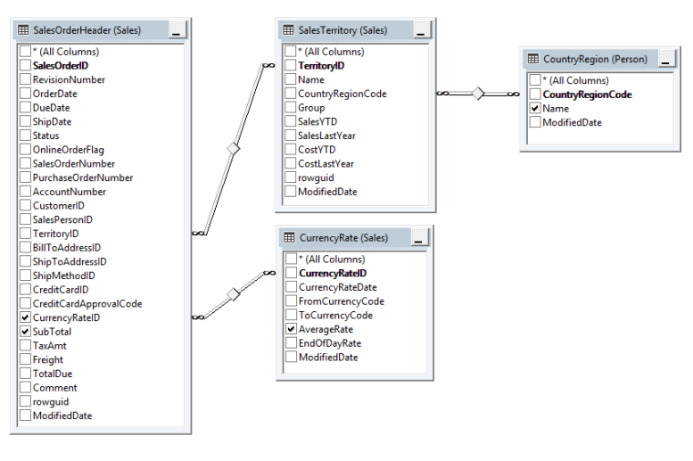
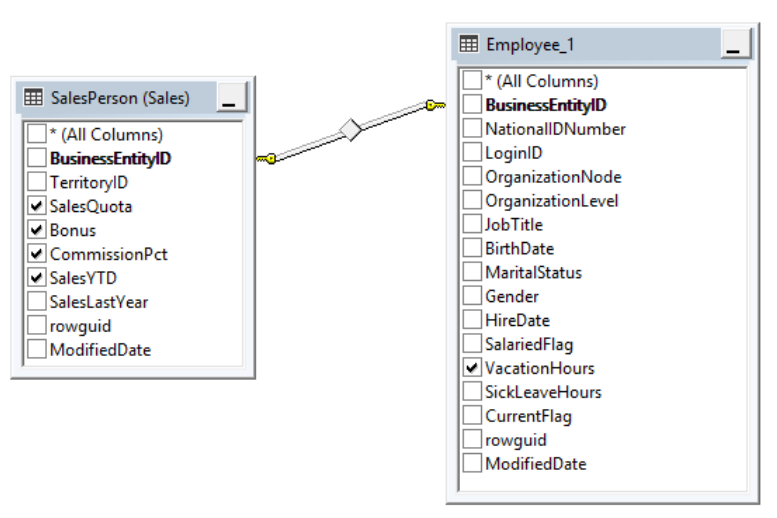
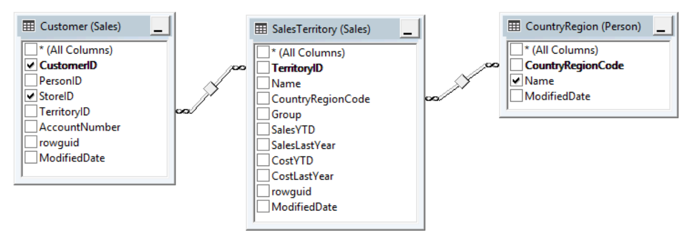
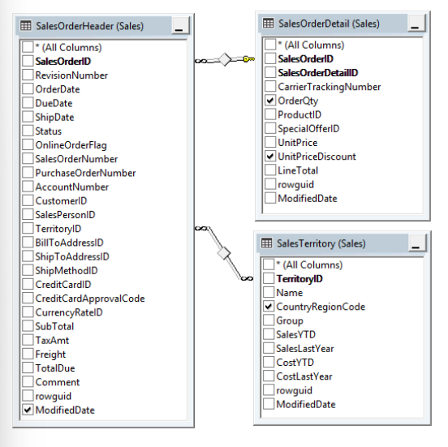
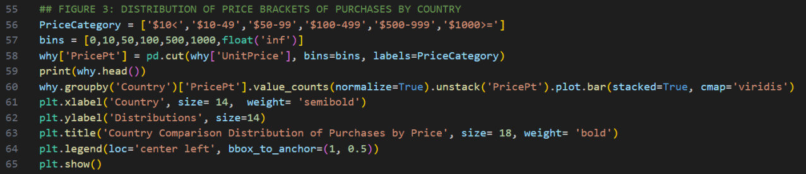
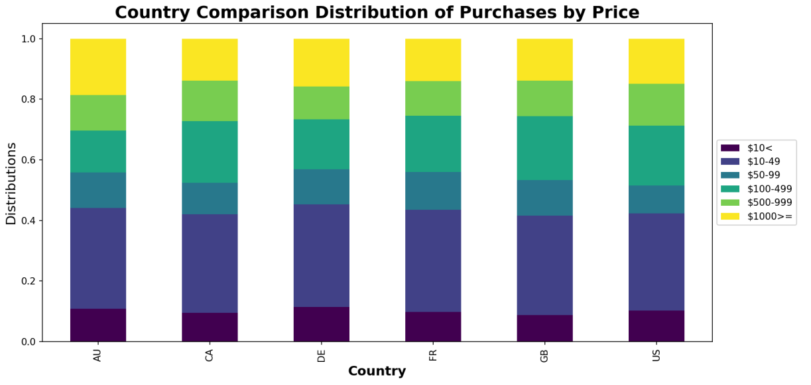

# Overview: What is the relationship between Country and Revenue? 

This analysis investigates the relationship between country operations and revenue generation.  

# Method: Primary Analysis 

## PART 1: Revenue Analysis with Currency Conversion 

Countries were already identified in Question 1. Only three years of sales data (June 2011 - May 2014) was used to answer the question as these dates overlapped in the tables joined; Sales.SalesOrderHeader and Sales.CurrencyRateID. Revenue was operationalised as SubTotal as it SubTotal = TotalDue- (TaxAmt + Freight).  

A crucial methodological step was converting revenue to USD to ensure a fair comparison. It was identified that FromCurrencyCode were all USD and the AverageRate was multiplied by the SubTotal for transactions where the CurrencyRateID was not null (i.e. a transaction took place). To ensure currency exchange fit, the aggregated revenue for each Country without currency exchange was calculated. In other words, for each country, underlying drivers for sales was compared against the total revenue with and without currency exchange to see if it was necessary to perform the exchange at all.  

_Step 1_

SQL:
```
- We need to perform a currency exchange. 
-- Without currency exchange, AUS outperforms UK, FR, DE which does not fit with rankings  
-- by units sold (historical data), customers or stores in each region (snapshot data) 
SELECT cr.Name AS Country, 
    SUM(CASE WHEN soh.CurrencyRateID IS NULL -- Note: AverageRate is always USD -> Another currency  
        THEN soh.SubTotal  
        ELSE soh.SubTotal / exch.AverageRate END)  
-- Did not use EndOfDayRate to account for transactions being taken at any time of day 
    AS TotalRevenueUSD -- Did not used Total Due to account for Taxes + Freight Costs 
FROM Sales.SalesOrderHeader AS soh  
    JOIN Sales.SalesTerritory AS st  
        ON soh.TerritoryID = st.TerritoryID  
    JOIN Person.CountryRegion AS cr
        ON st.CountryRegionCode = cr.CountryRegionCode  -- These two joins were to get the full country names 
    LEFT JOIN Sales.CurrencyRate AS exch -- CRUCIAL that it is a LEFT join to prevent duplicates  
        ON exch.CurrencyRateID = soh.CurrencyRateID  
WHERE soh.ModifiedDate BETWEEN '2011-05-31' AND '2014-05-31' 
-- SalesOrderHeader Data from June 2011 to July 2014 BUT CurrencyRate Data from May 2011 to May 2014  
-- Therefore we're looking at Total Revenue within this time frame.  
GROUP BY cr.Name  
ORDER BY TotalRevenueUSD DESC; 
```
.csv generated:
| Country         | TotalRevenueUSD  |
|-----------------|------------------|
| United States   |     62838406.88  |
| United Kingdom  |     11267299.08  |
| Canada          |     10653559.84  |
| France          |     7014975.537  |
| Australia       |     5794045.617  |
| Germany         |     4590089.732  |

_Step 2: Revenue without conversion (for comparison)._
SQL:
```
-- Without Exchange 
SELECT cr.Name AS Country, 
       SUM(soh.SubTotal) AS TotalRevenue 
FROM Sales.SalesOrderHeader AS soh  
    JOIN Sales.SalesTerritory AS st  
        ON soh.TerritoryID = st.TerritoryID  
    JOIN Person.CountryRegion AS cr 
        ON st.CountryRegionCode = cr.CountryRegionCode 
WHERE soh.ModifiedDate BETWEEN '2011-05-31' AND '2014-05-31' 
GROUP BY cr.Name  
ORDER BY TotalRevenue DESC;
```
| Country         | TotalRevenueUSD  |
|-----------------|------------------|
| United States   |     62838716.61  |
| Canada          |     16316323.87  |
| Australia       |      10555938.3  |
| United Kingdom  |     7612375.336  |
| France          |     7212610.727  |
| Germany         |     4866805.206  |

## PART 2: Investigating Underlying Revenue Drivers 
_Step 1: Length of Operations_
The operational footprint (number of stores, customers) and sales volume (units sold) were distributed amongst each country and graphed against revenue.  

SQL:
```
-- Currency exchange data had several issues. For the United States, there were 21 counts (0.18%) of transactions occurred with a currency exchange despite all starting currencies within the codes being USD. While this represents less than 1% of transaction, this indicates that currency exchange took place where it was not necessary and must be investigated in case of money laundering. For the UK, nearly 100% of orders used currency conversion, missing 3 counts (0.1%) and for Canada, 98.6% of orders used currency conversion, missing 53 counts (1.4%). While these figures are excellent, the finance department can strive towards an achievable 100% success rate. In Germany and France there are also missed counts; 8.53% and 4.44% respectively. While different companies may handle these transactions due to geographical reasons, Germany and France both entered the eurozone in 1999 and therefore should have similar conversion rates. France’s conversion rate is an alarming 4EUR to 1USD. 
# Recommendations 
### 1. Strategic Market Investment 
Prioritise marketing investment and potential store expansion in Canada and the UK, as they are the strongest performers after the US. For Australia and Germany, focus on customer acquisition strategies to build their market presence post-launch. 
### 2. Currency Exchange Process Improvements 
The finance departments are urged to immediately investigate the issues in currency exchange identified and renegotiate all conversion exchange rates for competitive pricing. This would ensure that AdventureWorks does not lose money on routine procedures, such as currency exchange, which in turn affect product pricing. 
### 3. System and Data Enhancements 
It is possible to perform imputation by pulling currency codes online but actual transactions change among cash vendors. Furthermore, it is unreasonable that many consumers in these territories paid in USD and thus, it can be assumed that such data is missing. To be certain, the IT department should introduce a CurrencyCode 0 to indicate no exchange took place and distinguish from where data is missing. Moreover, the UnitPrice in Sales.SalesOrderDetails does not match ListPrice in Sales.SalesPriceHistory (even when month/year modified are the same). This indicates a discount was given or a grave discrepancy between SalesOrderDetails and ListPrice. This must be followed up to understand why the product price was not sold at the price in which it was set to be sold.
```

_Step 2:  Operational Footprint (No. Of Stores & Customers)_ 

SQL:
```
SQL Script for Operational Footprint (No. Of Stores & Customers): 
-- Note: This is a snapshot of data as at 2014-09-12 
-- How many stores are there is each region?  
-- How many customers do we get per store?  
SELECT cr.Name AS Country,  
    COUNT(DISTINCT c.StoreID) AS NumStores,  
    COUNT(DISTINCT c.CustomerID) AS NumCustomers  
-- COUNT(DISTINCT c.CustomerID) / COUNT(DISTINCT c.StoreID) AS CustomersPerStore  
-- Just to demonstrate this data is a snapshot 
FROM Sales.Customer AS c 
    JOIN Sales.SalesTerritory AS t  
        ON t.TerritoryID = c.TerritoryID  
    JOIN Person.CountryRegion AS cr  
        ON cr.CountryRegionCode = t.CountryRegionCode  
WHERE c.StoreID IS NOT NULL  
-- THERE ARE A LOT OF NULLS (representing customers who have not revisited recently but came at least once) 
GROUP BY cr.Name 
ORDER BY NumCustomers;  
-- The US has the most stores, CA is runner up.  
-- FR, DE, GB AND AU has an equal number of stores.  
-- This fits perfectly with the revenue.  
-- But still why does CA and GB have similar revenues?
```
.csv generated:
| Country         | NumStores  | NumCustomers  |
|-----------------|------------|---------------|
| Germany         |        40  |           72  |
| Australia       |        40  |           74  |
| France          |        40  |           74  |
| United Kingdom  |        40  |           78  |
| Canada          |       114  |          220  |
| United States   |       427  |          818  |

_Step 3: Sales Volume Analysis_

SQL:
```
-- NumUnitsSold by Country 
SELECT SUM(sod.OrderQty) AS NumUnitsSold,  
    t.CountryRegionCode AS Country  
FROM Sales.SalesOrderHeader AS soh -- This table's last date is '2014-06-30' 
    JOIN Sales.SalesOrderDetail AS sod  
        ON soh.SalesOrderID = sod.SalesOrderID 
    JOIN Sales.SalesTerritory AS t  
        ON t.TerritoryID = soh.TerritoryID 
WHERE soh.ModifiedDate BETWEEN '2011-05-31' AND '2014-05-31'  
GROUP BY t.CountryRegionCode 
ORDER BY NumUnitsSold DESC; 
```
.csv generated
| Country  | NumUnitsSold  |
|----------|---------------|
| DE       |        12863  |
| AU       |        17690  |
| FR       |        19640  |
| GB       |        19768  |
| CA       |        48778  |
| US       |       152880  |

_Step 4: Python visualisation_
```
import matplotlib.pyplot as plt 
import pandas as pd 
import numpy as np 
import os 
os.chdir(r'<replace this with the path where you have the csv files downloaded') 

cr= pd.read_csv('mainCountryRev.csv') 
print(cr.head()) 
cust= pd.read_csv('CountryCustomers.csv') 
print(cust.head())  
units= pd.read_csv('CountryUnits.csv') 
print(units.head())  
why= pd.read_csv('FormingTargets.csv') 
print(why.head()) 

## FIGURE 2: INVESTIGATING REVENUE BY COUNTRY 
fig, ax = plt.subplots() 
revenue_pct = cr['TotalRevenueUSD'] / (cr['TotalRevenueUSD'].sum()) * 100 
stores_pct = cust['NumStores'] / (cust['NumStores'].sum()) * 100 
customers_pct = cust['NumCustomers'] / (cust['NumCustomers'].sum()) * 100 
units_pct = units['NumUnitsSold'] / (units['NumUnitsSold'].sum()) * 100 
width, x = 0.2, np.arange(len(cust['Country']))  
ax.bar(x - width, stores_pct, width=width, label='Stores', color='aquamarine', zorder=2) 
ax.bar(x, customers_pct, width=width, label='Customers', color='darkturquoise', zorder=2) 

ax.bar(x + width, units_pct, width=width, label='Units', color='skyblue', zorder=2) 
ax2 = ax.twinx()   
ax2.plot(x, revenue_pct, label='Revenue', color='blue', marker='o') 
ax.set_xlabel('Country', weight='bold') 
ax.set_ylabel('Percentage', weight='bold') 

ax.set_xticks(x, labels= cust['Country']) 
ax2.set_yticklabels([])  
ax2.set_yticks([]) 
ax.grid(axis='y', alpha=0.3, zorder=0) 
ax.set_title('Distribution of Factors Influencing Country Revenue', weight='bold', size=15) 

lines1, labels1 = ax.get_legend_handles_labels() 
lines2, labels2 = ax2.get_legend_handles_labels() 
ax.legend(lines1 + lines2, labels1 + labels2, loc='upper left') 
plt.tight_layout() 
plt.show() 
```

# Method: Secondary Analysis 
## PART 1: Investigating Price Strategies 
SQL:
```
-- What are they buying? How can we maximise revenue per country?  
-- We can do more targetted promotions. 
-- note: The data in this table are pre-tax/freight cost sales.  
SELECT DISTINCT sod.UnitPrice,  
    SUM(sod.OrderQty) AS NumUnitsSold,  
    COUNT(CASE WHEN sod.UnitPriceDiscount > 0 THEN 1 END) AS NumDiscountsGiven,  
    t.CountryRegionCode AS Country  
FROM Sales.SalesOrderHeader AS soh  
    JOIN Sales.SalesOrderDetail AS sod  
        ON soh.SalesOrderID = sod.SalesOrderID 
    JOIN Sales.SalesTerritory AS t  
        ON t.TerritoryID = soh.TerritoryID 
GROUP BY sod.UnitPrice, t.CountryRegionCode 
ORDER BY t.CountryRegionCode ASC, sod.UnitPrice DESC; 
-- Note: UnitPrice in sod does not match ListPrice in PriceHistory (even when month/year modified are the same)  
-- Yet, it was never registered that a discount was given. This discrepancy needs to be followed up.
```
.csv generated
| UnitPrice  | NumUnitsSold  | NumDiscountsGiven  | Country  |
|------------|---------------|--------------------|----------|
|     36.83  |           69  |                 6  | AU       |
|    4.9445  |           50  |                 3  | AU       |
|  313.1942  |           49  |                 4  | CA       |
|     36.83  |          287  |                22  | CA       |
|   430.563  |           11  |                 1  | DE       |



## PART 2: Analysing Currency Exchange Anomalies 

SQL:
```
-- TROUBLESHOOTING 
SELECT  
    cr.Name AS Country, 
    COUNT(*) AS TotalOrders, 
    SUM(CASE WHEN soh.CurrencyRateID IS NULL THEN 0 ELSE 1 END) AS OrdersWithExchange, 
    SUM(CASE WHEN soh.CurrencyRateID IS NULL THEN 1 ELSE 0 END) AS OrdersWithoutExchange, 
    AVG(CASE WHEN soh.CurrencyRateID IS NOT NULL THEN exch.AverageRate END) AS AvgExchangeRate, 
    AVG(CASE WHEN soh.CurrencyRateID IS NOT NULL THEN exch.EndOfDayRate END) AS AvgEndOfDayRate 
FROM Sales.SalesOrderHeader AS soh  
    JOIN Sales.SalesTerritory AS st ON soh.TerritoryID = st.TerritoryID  
    JOIN Person.CountryRegion AS cr ON st.CountryRegionCode = cr.CountryRegionCode 
    LEFT JOIN Sales.CurrencyRate AS exch ON exch.CurrencyRateID = soh.CurrencyRateID  
WHERE soh.ModifiedDate BETWEEN '2011-05-31' AND '2014-05-31' 
GROUP BY cr.Name 
ORDER BY OrdersWithoutExchange DESC;
```
# Findings 

The US generates over twice the revenue of all other countries combined. This leadership is directly explained by its larger operational scale (most stores and customers). Revenue ranking perfectly aligns with the number of stores and customers in each country. Australia and Germany entered the market later (mid-2013), explaining their lower revenue. Other markets (US, Canada, UK) have been operating since 2011-2012. There was no difference in the price distribution of products consumed by each geographic market. 

| UnitPrice  | NumUnitsSold  | NumDiscountsGiven  | Country  |
|------------|---------------|--------------------|----------|
|     36.83  |           69  |                 6  | AU       |
|    4.9445  |           50  |                 3  | AU       |
|  313.1942  |           49  |                 4  | CA       |
|     36.83  |          287  |                22  | CA       |
|   430.563  |           11  |                 1  | DE       |

 

Currency exchange data had several issues. For the United States, there were 21 counts (0.18%) of transactions occurred with a currency exchange despite all starting currencies within the codes being USD. While this represents less than 1% of transaction, this indicates that currency exchange took place where it was not necessary and must be investigated in case of money laundering. For the UK, nearly 100% of orders used currency conversion, missing 3 counts (0.1%) and for Canada, 98.6% of orders used currency conversion, missing 53 counts (1.4%). While these figures are excellent, the finance department can strive towards an achievable 100% success rate. In Germany and France there are also missed counts; 8.53% and 4.44% respectively. While different companies may handle these transactions due to geographical reasons, Germany and France both entered the eurozone in 1999 and therefore should have similar conversion rates. France’s conversion rate is an alarming 4EUR to 1USD. 

# Recommendations 

### 1. Strategic Market Investment 

Prioritise marketing investment and potential store expansion in Canada and the UK, as they are the strongest performers after the US. For Australia and Germany, focus on customer acquisition strategies to build their market presence post-launch. 

### 2. Currency Exchange Process Improvements 

The finance departments are urged to immediately investigate the issues in currency exchange identified and renegotiate all conversion exchange rates for competitive pricing. This would ensure that AdventureWorks does not lose money on routine procedures, such as currency exchange, which in turn affect product pricing. 

### 3. System and Data Enhancements 

It is possible to perform imputation by pulling currency codes online but actual transactions change among cash vendors. Furthermore, it is unreasonable that many consumers in these territories paid in USD and thus, it can be assumed that such data is missing. To be certain, the IT department should introduce a CurrencyCode 0 to indicate no exchange took place and distinguish from where data is missing. Moreover, the UnitPrice in Sales.SalesOrderDetails does not match ListPrice in Sales.SalesPriceHistory (even when month/year modified are the same). This indicates a discount was given or a grave discrepancy between SalesOrderDetails and ListPrice. This must be followed up to understand why the product price was not sold at the price in which it was set to be sold. 
