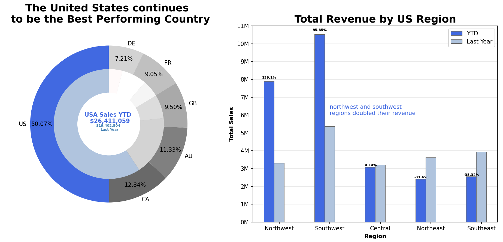
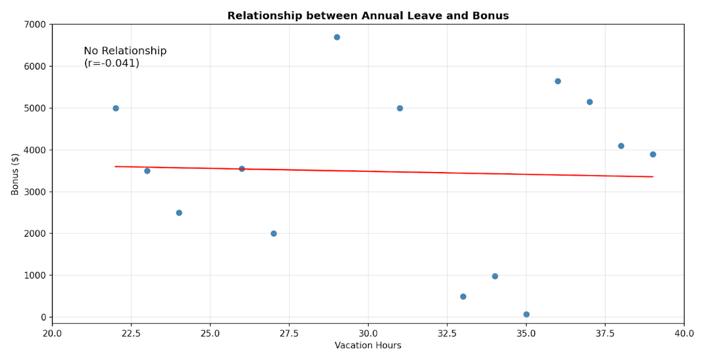

# Background 

Adventure Works Cycles is a fictitious manufacturer for bicycles and accessories, based in the US but operating globally. Scenarios include Manufacturing, Sales, Purchasing, Product Management, Contact Management, and Human Resources. The following was asked: 
  1. _What is the regional sales in the best performing country?_ 
  2. _What is the relationship between annual leave taken and bonus?_ 
  3. _What is the relationship between Country and Revenue?_ 
  4. _What is the relationship between sick leave and Job Title?_ 
  5. _What is the relationship between store trading duration and revenue?_ 
  6. _What is the relationship between the size of the stores, number of employees and revenue?_ 

The deliverables included a non-technical presentation for stakeholders (focusing on key insights and recommendations) and a technical report (including all scripts composed). 

_Note: We originally split these 6 questions amongst 5 data analyst trainees as part of an interim project. **My key contribution was for question 3**, however, as I revise the project, I will upload my answers to other questions later._ :) 

# Data Structure 

The AdventureWorks2019 .bak file is publicly provided by Microsoft for practice. The database comprises of over 71 tables across 5 schema, 20 views and thousands of realistic records. It is primarily OLTP simulating real-time transactions and is normalised (3+)- this just means you will need to perform joins and give care to interpretation.  

_Note: An entity relationship diagram (ERD) is provided for each question which will help map out the links between tables._ 

# Executive Summary 

### Question 1 

The best performing country by sales revenue is the United States (US) because of its operational size. The highest performing region within the US last year and year to date (YTD) was the southwest region. While the year is incomplete, the southwest and northwest regions have doubled their performance compared to last year!  

### Question 3

US generates over 2x revenue of all other countries combined. Revenue rankings align perfectly with store/customer counts per country. This might be because Australia and Germany entered the market in 2013, while US,Canada and UK have been operating since 2011-2012. 

# Deep Dive 
_(Click links for more a step-by-step guide and detailed conclusions)_

### [Question 1](Question1.md) 

The *Northwest and Southeast region sales are underperforming* against expectations. In review of the store dates, it appeared that Northwest, Northeast and Central regions had a *store relocation*. Perhaps, these sales reflect these changes.  

*Northwest and Southwest regions have doubled their performance this year*. There is insufficient data surrounding targeted sales promotions in these regions. This may reflect how Northwest and Southwest regions have larger operations (more stores).  

### [Question 3](Question3.md) 

| Country        | TotalOrders | OrdersWithExchange | OrdersWithoutExchange | AvgExchangeRate | AvgEndOfDayRate |
|----------------|-------------|--------------------|-----------------------|-----------------|-----------------|
| United States  | 11518       | 21                 | 11497                 | 1.5629          | 1.5615          |
| France         | 2567        | 114                | 2453                  | 3.9295          | 3.9294          |
| Germany        | 2508        | 214                | 2294                  | 1.4138          | 1.4138          |
| Canada         | 3809        | 3756               | 53                    | 1.5608          | 1.5606          |
| United Kingdom | 3081        | 3078               | 3                     | 0.6738          | 0.6738          |
| Australia      | 6574        | 6574               | 0                     | 1.8462          | 1.8461          |

There are anomalies in currency exchange data recorded. While different companies may handle these transactions due to geographical reasons, Germany and France both entered the eurozone in 1999 and therefore should have similar conversion rates. France’s conversion rate is an alarming 4EUR to 1USD. There are also missed counts; 8.53% and 4.44% respectively, which should be cautioned for potential financial mismanagement.  

# Recommendations 

1. Adventure Cycle Works replicates the sales strategies used from western regions identified and *inspect  store relocation performances more closely*. Focus on customer *acquisition strategies for Australia and Germany* to build their market presence following their more recent launch. 

2. The company should *track performance quarterly* instead of annually to maintain growth and intervene quickly where necessary. The IT department should implement a CurrencyCode 0 to clearly indicate when no currency exchange took place, *distinguishing this scenario from missing data*. 

3. The finance department should *immediately investigate the identified currency exchange issues* and renegotiate all conversion exchange rates to ensure competitive pricing. 

 

 
